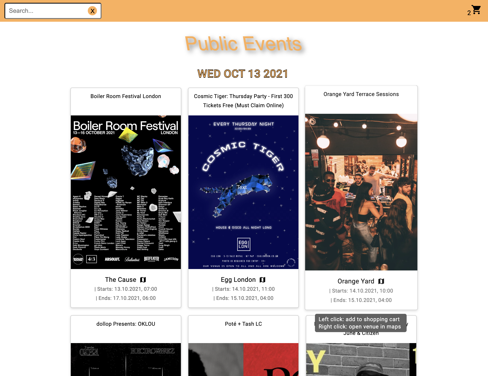

# Events App

Die Events App ist eine Anwendung, die es Benutzern ermöglicht, Events zu durchsuchen und zu ihrem Warenkorb hinzuzufügen. Die Events werden nach Datum sortiert und das Datum bleibt sichtbar, während der Benutzer durch die Liste scrollt. Benutzer können Events zu ihrem Warenkorb hinzufügen und eine Übersicht aller hinzugefügten Events anzeigen. Durch Klicken auf die Event-Location wird ein neuer Tab mit der Google Maps Location geöffnet. Die Suchfunktion ermöglicht es Benutzern, Events zu finden, die einen bestimmten Suchbegriff im Titel enthalten.

## Anforderungen

- Node.js
- Angular CLI

## Installation

1. Klonen Sie das Repository auf Ihren lokalen Computer.
2. Navigieren Sie in das Verzeichnis des Projekts und führen Sie `npm install` aus, um alle Abhängigkeiten zu installieren.

## Verfügbare Skripte

- `npm run start`: Startet die Anwendung im Entwicklungsmodus und öffnet sie im Browser.
- `npm run build`: Erstellt die Anwendung für die Produktion in den `dist` Ordner.
- `npm run watch`: Baut die Anwendung und beobachtet Änderungen in den Dateien, um sie automatisch neu zu bauen.

## Zusätzliche Plugins

- `@ngxs/devtools-plugin`: Ein Plugin für die NGXS State Management Library, das die Integration mit den Redux DevTools in Chrome und Firefox ermöglicht.
- `@ngxs/logger-plugin`: Ein Plugin für die NGXS State Management Library, das Zustandsänderungen in der Konsole protokolliert.
- `@ngxs/store`: Die NGXS State Management Library, eine state management Lösung für Angular, die auf dem Muster von Redux basiert, aber die Angular-Philosophie und -Syntax nutzt.
- `immer`: Eine Bibliothek zur Arbeit mit unveränderlichen Zustandsstrukturen.
- `material-icons`: Eine Bibliothek, die Material Design Icons zur Verfügung stellt.
- `ngx-toastr`: Eine Bibliothek für Toast-Benachrichtigungen für Angular.
- `rxjs`: Eine Bibliothek für reaktive Programmierung mit Observables.
- `tslib`: Eine Runtime-Bibliothek für TypeScript, die Hilfsfunktionen enthält.
- `zone.js`: Eine Bibliothek, die eine Zone-basierte Ausführungsumgebung für JavaScript bereitstellt, die für die Änderungserkennung in Angular benötigt wird.

